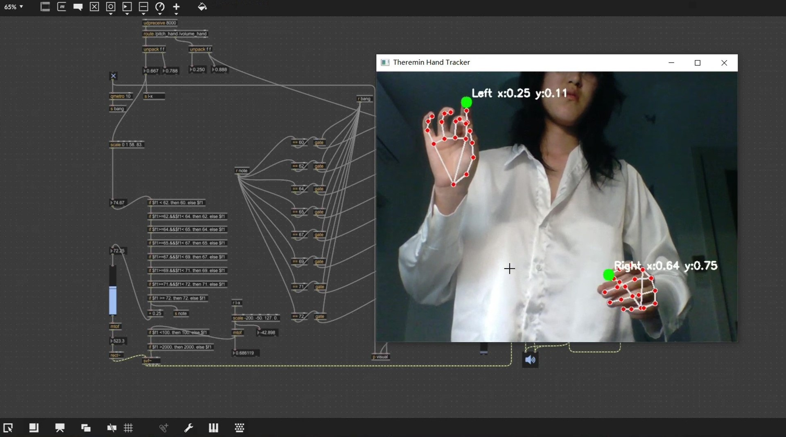

# 🎛️ Electronic Theremin | 电子特雷门琴

*A touchless musical interface driven by body movement and real-time computation.*
 一个由身体动作与实时计算驱动的非接触式乐器界面。

## 🎬 演示视频 | Demo Video

点击下方图片观看完整演示（Bilibili）  
Click the image below to watch the full demo on Bilibili:

[](https://www.bilibili.com/video/BV1MigozHEjt)

------

### 🎨 Project Concept | 项目设计思路

This project is a digital reinterpretation of the theremin, one of the earliest electronic instruments, using computer vision and OSC protocols to replace analog antennas with real-time hand tracking. By using Python (MediaPipe + OpenCV) to capture hand position and sending it to Max/MSP via OSC, performers can play pitch and volume in mid-air, echoing the original instrument's touchless nature.
 本项目是对世界上最早的电子乐器之一——特雷门琴的数字化重构。它使用计算机视觉与 OSC 协议，取代传统模拟天线，通过 Python（MediaPipe + OpenCV）实时捕捉手部位置，并通过 OSC 发送到 Max/MSP，实现音高和音量的空中控制，重现特雷门琴的非接触演奏特性。

This piece is designed for interactive installations, digital performances, or experimental audio research, and encourages embodied interaction between human gesture and sound synthesis.
 作品可用于互动装置、数字艺术表演或实验音乐研究，强调身体动作与声音生成之间的即时反馈与情感联系。

This project is inspired by [willowhong/Theremin](https://github.com/willowhong/Theremin), which uses Leap Motion to control pitch and volume in Max/MSP via MIDI. While their approach is hardware-dependent, this version reimagines the theremin using computer vision, enabling wider accessibility with a standard webcam.
 本项目参考了 GitHub 上的 [willowhong/Theremin](https://github.com/willowhong/Theremin)，该项目通过 Leap Motion 捕捉手势，在 Max/MSP 中输出 MIDI 实现对音高和音量的控制。不同于硬件依赖方式，本项目基于计算机视觉，任何具备摄像头的设备即可运行，拥有更广泛的可接入性。

------

### 🛠️ System Requirements | 系统需求

- Python 3.8+
- Max/MSP 8+

------

### 📦 Python Dependencies | Python 依赖包安装

```bash
pip install opencv-python mediapipe python-osc
```

Or create a `requirements.txt`:
 或创建一个 `requirements.txt` 文件：

```txt
opencv-python  
mediapipe  
python-osc  
```

Then install with:
 然后使用以下命令安装：

```bash
pip install -r requirements.txt
```

------

### 🧠 How It Works | 工作原理

```text
[Hand Tracking - Python (MediaPipe)]  
        ↓ x, y  
[OSC Protocol - python-osc]  
        ↓ /pitch_hand /volume_hand  
[Max/MSP - Receives & Synthesizes Audio]  
```

- Right hand controls pitch `/pitch_hand [x, y]`
   右手控制音高 `/pitch_hand [x, y]`
- Left hand controls volume `/volume_hand [x, y]`
   左手控制音量 `/volume_hand [x, y]`
- Default OSC port: `localhost: 8000`
   默认 OSC 端口：`localhost: 8000`

------

### 🎬 Demo Usage | 演示使用方法

1. Run the Python script: `python theremin_controller.py`
    启动 Python 脚本：`python theremin_controller.py`
2. Open Max/MSP patch `Digital-Theremin.maxpat`
    打开 Max/MSP 工程 `Digital-Theremin.maxpat`
3. Move your hands in front of the webcam: right hand controls pitch (left-right), left hand controls volume (up-down)
    将手伸入摄像头前方，右手左右移动控制音高，左手上下移动控制音量

------

### 🔗 Optional Extensions | 拓展建议

- Design a basic UI using Tkinter or PyQt to show pitch/volume levels
   使用 Tkinter 或 PyQt 设计基础界面，显示音高与音量值
- Add semitone support by dividing hand position into 12 tone regions
   添加半音阶支持，将手部区域划分为 12 个固定音高区段
- Implement multiple sound types using Max/MSP synth modules
   在 Max/MSP 中添加多种音色模块，实现音色切换
- Map finger tremble to sound modulation via MediaPipe high-frequency gesture detection
   基于手指颤动控制音色变化，可通过 MediaPipe 识别手部高频抖动实现

